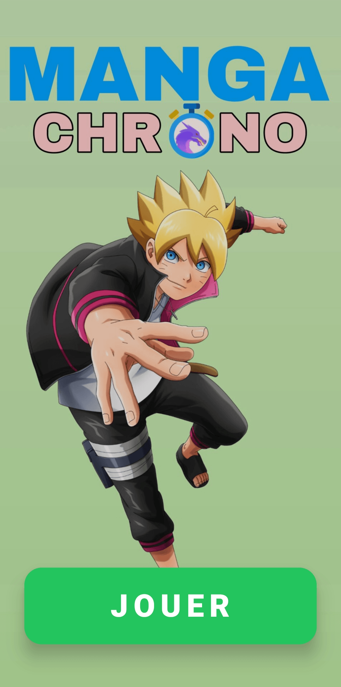
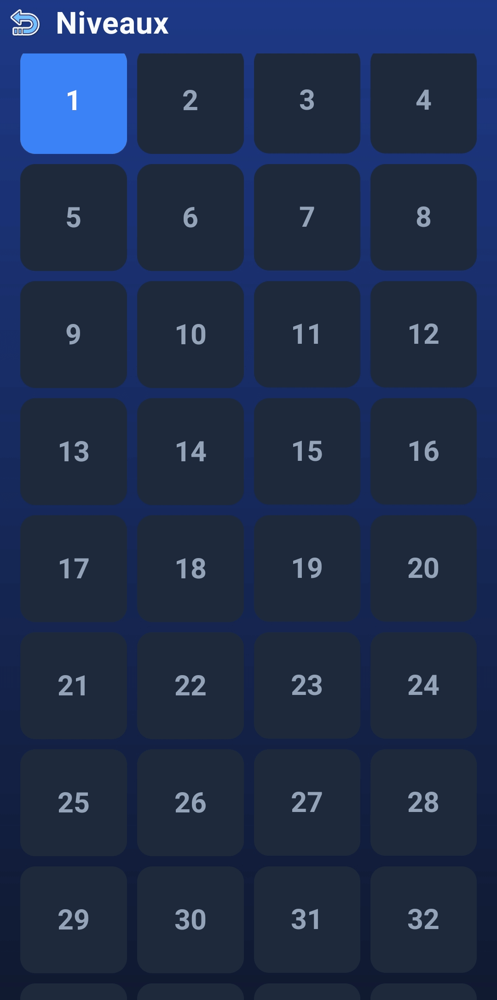
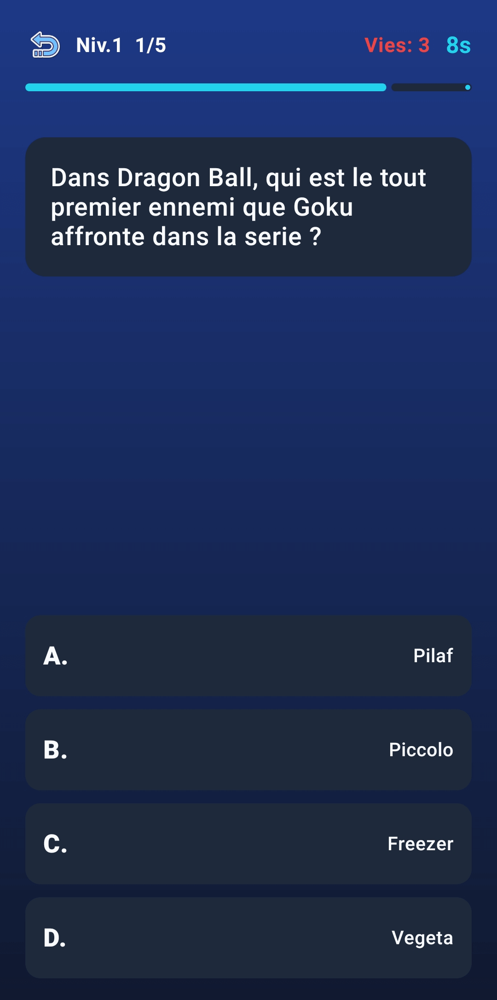

# 🎮 Manga Chrono

Application Android de quiz sur la culture manga, développée avec **Kotlin** et **Jetpack Compose**.

---

## 📱 Fonctionnalités

- 🎯 **100 niveaux à débloquer** : progressez un par un
- 📚 **100 questions manga** : Shonen, Seinen, Sports, Isekai, Ghibli...
- ❤️ **3 vies par niveau** : 5 questions par niveau
- ⏱️ **Mode chrono** : 10 secondes par question
- 🔁 **Passage automatique** : 1,5 s après la réponse avec affichage de la bonne réponse en vert
- 💾 **Sauvegarde locale** : progression persistante avec SharedPreferences
- 🎨 **Interface sombre** : Material 3 avec thème personnalisé
- 🖼️ **Background personnalisé** : ambiance manga sur le menu
- 🔒 **Bouton retour** : intégré en haut à gauche (niveaux + jeu)

---

## 📸 Captures d'écran

### Navigation dans l'application

| Écran                                   | Description                |
| --------------------------------------- | -------------------------- |
|  | **Icône de l'application** |
|  | **Menu principal**         |
|  | **Choix de niveau**        |
|  | **MangaChrono**            |

---

## 🛠️ Prérequis

Avant de commencer, assurez-vous d'avoir installé :

| Outil             | Version minimale                | Téléchargement                                          |
| ----------------- | ------------------------------- | ------------------------------------------------------- |
| **IntelliJ IDEA** | 2024.1+ (Community ou Ultimate) | [Télécharger](https://www.jetbrains.com/idea/download/) |
| **JDK**           | 17 ou supérieur                 | [Télécharger](https://adoptium.net/)                    |
| **Git**           | 2.30+                           | [Télécharger](https://git-scm.com/)                     |

---

## 📥 Installation

---

### 1️⃣ Cloner le projet

#### Via HTTPS

git clone https://github.com/Johanes-mg/MangaChrono.git

#### Accéder au dossier

cd MangaChrono

---

### 2️⃣ Ouvrir dans IntelliJ IDEA

#### IntelliJ IDEA

Lancer le programme

Sélectionnez le dossier MangaChrono et faites vos modifs

---

## 📦 Génération de l'apk

### Nettoyer le projet et debug

##### Sur Windows (PowerShell ou CMD)

gradlew clean
gradlew assembleDebug

##### Sur Linux

./gradlew clean
./gradlew assembleDebug

---

### 📂 Où trouver l'APK Debug ?

~MangaChrono\app\build\outputs\apk\debug\app-debug.apk

---

## Auteur

Johanès Falitiana

## Licence

MIT
ENDOFREADME
